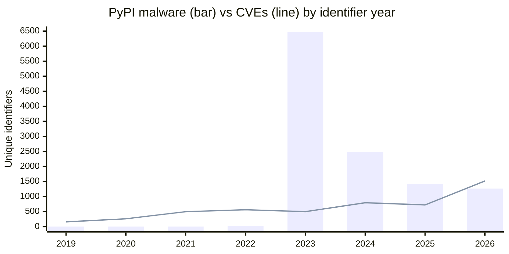
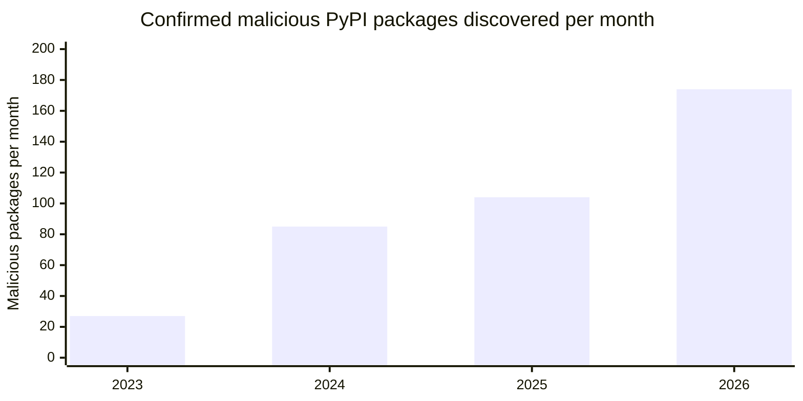

# Malware vs CVEs in the PyPI Ecosystem

Malicious packages and vulnerabilities are tracked by different identifier systems, and those
systems do not overlap. Of 11,650 malware identifiers in the PyPI ecosystem, **zero** have a CVE
assigned.

Malicious packages planted on public registries receive no CVE because they are not defective software as they are considered malware. Data from OSV.dev shows the scale of the threat that exists entirely outside CVE tracking.

Data source: the full OSV PyPI export (`PyPI/all.zip`), retrieved 2026-08-12, containing 24,851
advisory records.

## Malware and CVEs by year on python based projects

| Year | Malware (`MAL-`) | CVEs | Malware with a CVE | Malware share |
|:-----|-----------------:|-----:|-------------------:|--------------:|
| 2017 | 0 | 120 | 0 | 0% |
| 2018 | 0 | 131 | 0 | 0% |
| 2019 | 0 | 158 | 0 | 0% |
| 2020 | 0 | 259 | 0 | 0% |
| 2021 | 0 | 496 | 0 | 0% |
| 2022 | 20 | 560 | 0 | 3% |
| 2023 | 6,468\* | 497 | 0 | 93%\* |
| 2024 | 2,478 | 793 | 0 | 76% |
| 2025 | 1,419 | 721 | 0 | 66% |
| 2026 | 1,265† | 1,516 | 0 | 45% |
| **Total** | **11,650** | **5,251** | **0** | |

\* 2023 malware is inflated by a retroactive bulk import (see below). Treat that row's share as an
artifact, not a measurement.
† 2026 is a partial year, through 2026-08-12.

An additional 618 CVEs carry identifiers earlier than 2017, giving 5,869 unique CVEs across the
whole export.



The 2023 malware bar is a data-ingestion event rather than an attack wave. It is left visible
here so the artifact is not hidden, but the discovery-rate chart below is the figure to cite.

### Method

Counts use the year embedded in each identifier (`CVE-YYYY-`, `MAL-YYYY-`) rather than the OSV
publication date. Publication date records when OSV ingested a record, not when the issue was
assigned, so retroactive imports would otherwise attribute decade-old CVEs to 2026. Identifiers
are deduplicated, so a vulnerability recorded as both a `GHSA-` and a `PYSEC-` advisory counts
once — without this, July 2026 alone contributes 2,920 records, most of them duplicate `PYSEC-`
IDs minted for advisories that already existed.

The zero in the overlap column is not a rounding artifact. It was checked three ways — by
publication date, by deduplicated earliest date, and by identifier year — and is exactly zero in
all three.

## Discovery rate

Yearly malware totals cannot be compared directly, because two months contain retroactive bulk
imports rather than newly discovered malware:

- **2023-02** — 6,170 entries, 2,840 of them dated 2023-02-25 alone
- **2024-06** — 1,715 entries

Together these are 7,885 entries, 68% of all PyPI `MAL-` records. Excluding those two months and
counting per month gives a clean series:

| Year | Entries | Months counted | Rate |
|:-----|--------:|---------------:|-----:|
| 2023 | 298 | 11 | 27/month |
| 2024 | 931 | 11 | 85/month |
| 2025 | 1,245 | 12 | 104/month |
| 2026 | 1,219 | 7 | 174/month |



Discovery has risen roughly 6.4x since 2023, with 2026 running 67% above 2025. Months with no
recorded entries count as zero rather than being dropped from the denominator.

Monthly series, bulk-import months marked `*`:

| Year | Jan | Feb | Mar | Apr | May | Jun | Jul | Aug | Sep | Oct | Nov | Dec |
|:-----|----:|----:|----:|----:|----:|----:|----:|----:|----:|----:|----:|----:|
| 2022 | 0 | 0 | 0 | 0 | 10 | 0 | 0 | 10 | 0 | 0 | 0 | 0 |
| 2023 | 2 | 6170\* | 144 | 8 | 67 | 8 | 4 | 13 | 20 | 20 | 3 | 9 |
| 2024 | 0 | 1 | 13 | 2 | 6 | 1715\* | 219 | 134 | 100 | 119 | 226 | 111 |
| 2025 | 26 | 106 | 128 | 68 | 85 | 71 | 194 | 265 | 64 | 75 | 77 | 86 |
| 2026 | 92 | 147 | 221 | 186 | 235 | 176 | 162 | 51† | | | | |

## Named incidents are tracked separately

The widely reported Python supply chain incidents carry neither `MAL-` IDs nor, in one case, any
PyPI advisory at all, because they affected packages that were legitimate until a release or an
account was compromised:

| Incident | Identifier | Notes |
|:---------|:-----------|:------|
| Ultralytics | `PYSEC-2024-154` | Compromised GitHub Actions workflow published crypto-miner wheels; the source repository was clean |
| ctx | `GHSA-4g82-3jcr-q52w`, `PYSEC-2022-199` | Maintainer account hijacked |
| PyTorch torchtriton | absent from the PyPI export | Dependency confusion against a private index |

`MAL-` entries instead measure the continuous background volume of typosquats and info-stealers.

## Representative examples

| ID | Package | Published | Mechanism |
|:---|:--------|:----------|:----------|
| [MAL-2026-13487](https://osv.dev/vulnerability/MAL-2026-13487) | `flasq` | 2026-08-07 | `flask` typosquat. `setup.py` registers a custom install `cmdclass` whose post-install hook is a base64 blob, decoded and `exec`'d **at install time** |
| [MAL-2026-11413](https://osv.dev/vulnerability/MAL-2026-11413) | `reguestsc` | 2026-07-31 | Clone of `requests` that downloads and runs a remote executable on import. Carried version `2.34.2`, matching the real `requests` release |
| [MAL-2026-12503](https://osv.dev/vulnerability/MAL-2026-12503) | `numpyp` | 2026-08-05 | One-character edit of `numpy`. Ships no wheel, only an sdist, forcing `setup.py` execution on install |

`flasq` is the clearest illustration of why verification must precede installation: the payload
runs during `pip install`, before any `import` statement is reached.

## What attestations do and do not prove

Checked against the PyPI `/integrity/` endpoint on 2026-08-12, current releases of widely used
packages carry a publish attestation naming the repository and workflow that built them:

| Package | Version | Attested build source |
|:--------|:--------|:----------------------|
| numpy | 2.5.2 | `numpy/numpy-release` — `wheels.yml` |
| requests | 2.34.2 | `psf/requests` — `publish.yml` |
| flask | 3.1.3 | `pallets/flask` — `publish.yaml` |
| cryptography | 50.0.0 | `pyca/cryptography` — `pypi-publish.yml` |
| sigstore | 4.5.0 | `sigstore/sigstore-python` — `release.yml` |

All three malicious packages above fail this check: `flasq` and `reguestsc` have been removed from
PyPI, and `numpyp` publishes no wheel to attest.

**A missing attestation is not evidence of malware.** `colorama` 0.4.6 returns HTTP 404 from the
same endpoint and is entirely legitimate — its last release predates
[PEP 740](https://peps.python.org/pep-0740/), as does most of the existing PyPI back catalogue. The
defensible reading is the positive one: an attestation naming an *expected* repository and workflow
is evidence of provenance, and a **mismatch** is a strong signal. Absence alone only means no
provenance evidence is available.

## Why this matters for the rule

This data supports
[pyscg-0059: Use Keyed Message Authentication for Shared-Secret Integrity](issue_711_building_blocks_draft.md)
and its observation that HMAC does not solve publisher provenance or public software distribution.

Scanning dependencies against CVE databases, however diligently, cannot detect any of the 11,650
malware entries counted here. There is no fixed version to upgrade to, because nothing is broken.
Provenance verification and vulnerability management address different failures, and neither
substitutes for the other.

## Reproducing this data

```bash
curl -sSLO https://osv-vulnerabilities.storage.googleapis.com/PyPI/all.zip
unzip -q all.zip -d entries
ls entries | grep -c '^MAL-'
```

Per-year counts read the `id` and `aliases` fields of every entry; per-month counts read
`published`.
